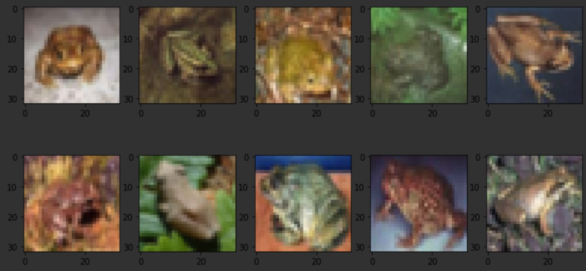
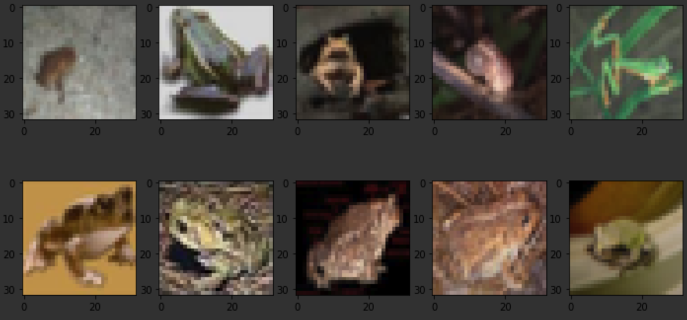

# mc_dropout_tensorflow

This repository reimplemented "MC Dropout" by tensorflow 2.0 Eager Extension.  
paper: Dropout as a Bayesian Approximation: Representing Model Uncertainty in Deep Learning 
(https://arxiv.org/pdf/1506.02142.pdf)

## Results
The higher entropy, the more difficult it is to predict.  
The top 10 for the case of "bird" and "frog" is shown.

・High entropy top 10　
 
 
 

・Low entropy top 10  
 

 
