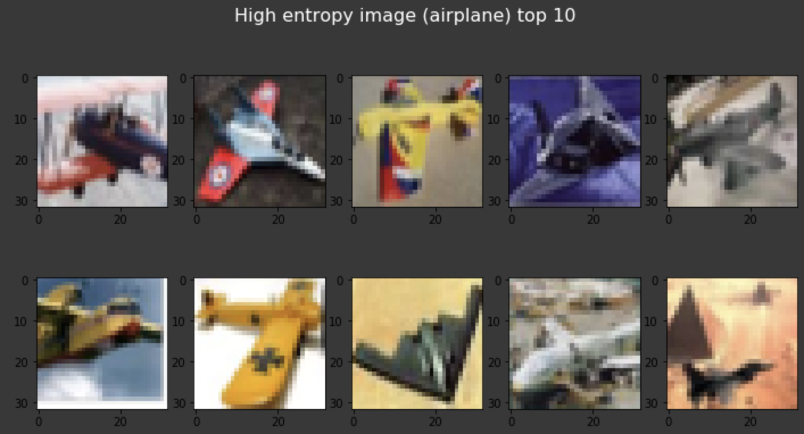
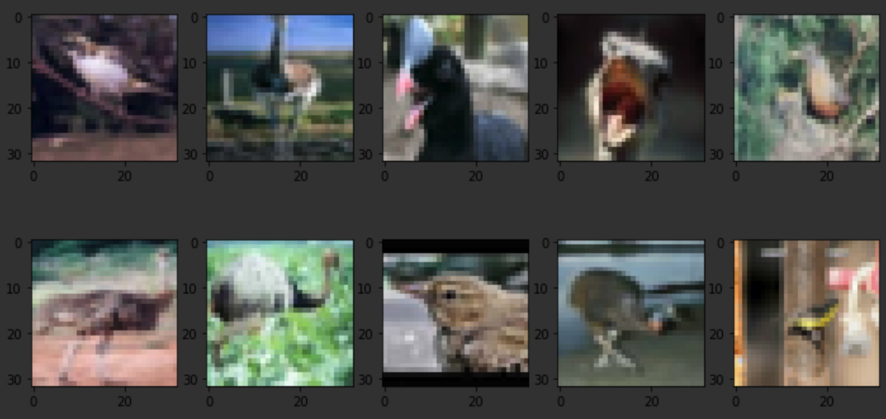
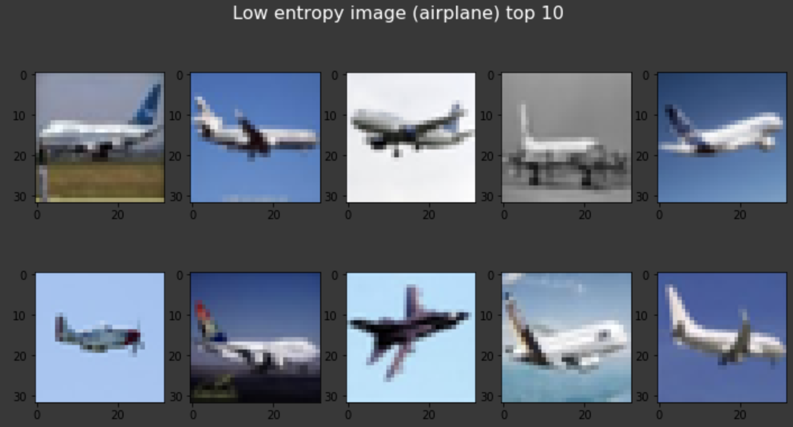
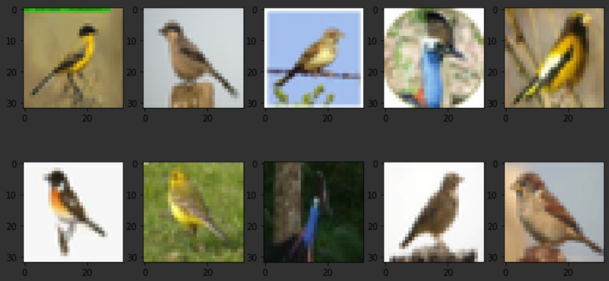

# mc_dropout_tensorflow

This repository reimplemented "MC Dropout" by tensorflow 2.0 Eager Extension.  
paper: Dropout as a Bayesian Approximation: Representing Model Uncertainty in Deep Learning 
(https://arxiv.org/pdf/1506.02142.pdf)

## Results
Here are the demo results. The condition is below.
```
Dataset : CIFAR-10

Model Training :
    Epoch : 10
    Dropout Rate : 0.5

Prediction :
    Sample Number : 100

```

The higher entropy, the more difficult it is to predict.  
The top 10 for the case of "airplane" and "bird" is shown.


・High entropy top 10　

 
 
 


・Low entropy top 10  

 

 
